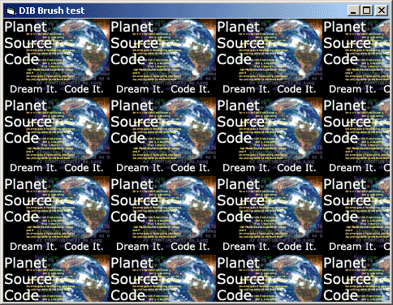



## DIB Brush \(Easy image tiling using FillRect\)

### Description

A simple class to show how to tile an image using FillRect.
 
### More Info
 

             |
---                |---
**Submitted On**   |2003-02-11 18:31:04
**By**             |[Carles P\.V\.](https://github.com/Planet-Source-Code/PSCIndex/blob/master/ByAuthor/carles-p-v.md)
**Level**          |Intermediate
**User Rating**    |5.0 (55 globes from 11 users)
**Compatibility**  |VB 6\.0
**Category**       |[Graphics](https://github.com/Planet-Source-Code/PSCIndex/blob/master/ByCategory/graphics__1-46.md)
**World**          |[Visual Basic](https://github.com/Planet-Source-Code/PSCIndex/blob/master/ByWorld/visual-basic.md)
**Archive File**   |[DIB\_Brush\_1542912112003\.zip](https://github.com/Planet-Source-Code/carles-p-v-dib-brush-easy-image-tiling-using-fillrect__1-40585/archive/master.zip)

